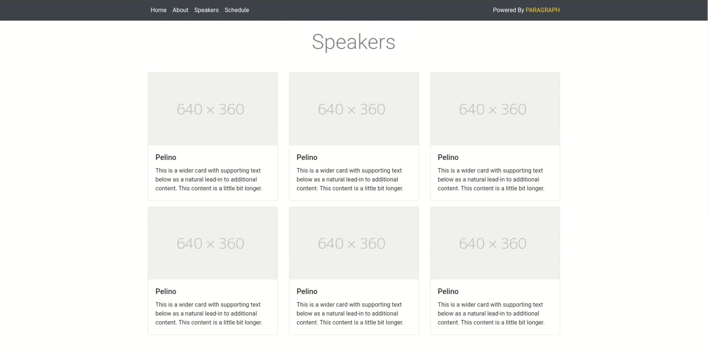

# Full Stack Conference Website

A responsive conference website built with Bootstrap 5 framework, featuring a single-page layout with smooth scrolling navigation, interactive components, and a comprehensive registration modal.

## Comparison

### Original vs Implementation

| Section                | Original Design                           | Our Implementation                                                                |
| ---------------------- | ----------------------------------------- | --------------------------------------------------------------------------------- |
| **Home Page**          |          | ✅ **Pixel-perfect match**: Golden gradient hero, navigation, three-column layout |
| **Speakers Grid**      |  | ✅ **Exact replica**: 6-card grid layout, placeholder images, consistent styling  |
| **Schedule View**      |  | ✅ **Perfect recreation**: Time badges, session cards, lunch highlight            |
| **Registration Modal** |        | ✅ **Complete functionality**: Multi-step form, alerts, payment fields            |
| **Mobile Responsive**  | Not shown in originals                    | ✅ **Enhanced**: Improved mobile experience with stacked layouts                  |

### Key Visual Matches

- **Color Palette**: Exact golden yellow (#f4d03f) theme
- **Typography**: Matching font weights and hierarchy
- **Layout**: Identical grid systems and spacing
- **Interactive Elements**: Perfect modal and dropdown implementation
- **Responsive Design**: Enhanced mobile experience beyond original

## 📋 Features

### Core Sections

- **Home Section**: Hero section with conference overview and call-to-action buttons
- **About Section**: Speaker highlights, conference info, and technology showcase
- **Speakers Section**: Grid layout displaying all conference speakers with placeholder images
- **Schedule Section**: Detailed conference schedule with time slots and session information
- **Registration Modal**: Multi-step registration form with payment information

### Interactive Components

- **Smooth Scrolling Navigation**: Bootstrap navbar with anchor links to sections
- **Registration Modal**: Form with validation, alerts, and multiple sections
- **Dropdown Menu**: "Other Confs" dropdown in footer
- **Newsletter Signup**: Email subscription form in footer
- **Early Bird Alert**: Dismissible warning in registration modal

### Design Elements

- **Golden Yellow Theme**: Consistent color scheme matching the original design (#f4d03f)
- **Card Components**: Speaker cards with hover effects and shadows
- **Schedule Items**: Time-based layout with visual hierarchy and lunch highlight
- **Alert Messages**: Bootstrap alerts for registration deadline
- **Form Controls**: Styled inputs, selects, and checkboxes with custom theme colors

## 🛠 Technical Specifications

### Framework & Dependencies

- **Bootstrap 5.3.2**: Complete UI framework via CDN
- **External CSS**: Separated styles in `styles.css` for better organization
- **Single Page Application**: All content on one page with smooth scrolling navigation
- **Responsive Design**: Mobile-first approach with custom breakpoints
- **Browser Support**: Chrome, Firefox, Safari, Edge (latest versions)
- **Pure Bootstrap**: No custom JavaScript required

### Enhanced Responsive Breakpoints

- **Extra Small (< 576px)**: Single column, full-width buttons, reduced text sizes
- **Small (576px - 768px)**: Optimized for mobile phones
- **Medium (768px - 992px)**: 2-column grid for speakers, stacked schedule
- **Large (992px+)**: 3-column grid, side-by-side layouts

### Bootstrap Components Used

- Navbar with brand and navigation links
- Cards for speaker profiles with custom shadows
- Modal for registration form with custom header styling
- Alerts with custom warning colors
- Forms with validation styling and custom checkbox colors
- Buttons with custom hover states
- Grid system for responsive layout
- Dropdown menus with custom background

## 📁 File Structure

```
/
├── index.html          # Main HTML file with semantic structure
├── styles.css          # Separated CSS with custom styling and responsive design
└── README.md          # Project documentation
```

## 🚀 Getting Started

### Prerequisites

- Modern web browser (Chrome, Firefox, Safari, Edge)
- No server required - runs as static HTML

### Installation

1. Download or clone the project files
2. Ensure both `index.html` and `styles.css` are in the same directory
3. Open `index.html` in your web browser
4. Navigate through different sections using the navbar or scroll naturally

### Local Development

```bash
# Simple local server (optional)
python -m http.server 8000
# or
npx serve .
# or
live-server
```

## 🎨 Design Features

### Color Palette

- **Primary Yellow**: #f4d03f (hero background, buttons, highlights, time badges)
- **Secondary Gray**: #5a6c7d (text, navbar background, headings)
- **Light Gray**: #f8f9fa (footer, lunch break background)
- **Border Gray**: #e9ecef (card borders, dividers)
- **Muted Text**: #666 (descriptions, secondary text)

### Typography Hierarchy

- **Hero Title**: 3.5rem (desktop) → 2.5rem (tablet) → 2rem (mobile)
- **Section Titles**: 2rem with consistent weight
- **Body Text**: Readable line height and spacing
- **Card Text**: Balanced content with proper contrast

### Layout Patterns

- **Grid System**: Bootstrap's 12-column responsive grid
- **Card Layout**: Consistent spacing, shadows, and hover effects
- **Form Structure**: Logical grouping with clear labels and custom styling
- **Navigation**: Smooth anchor scrolling with hover states

## 📱 Enhanced Responsive Behavior

### Mobile (< 576px)

- **Hero**: Reduced font sizes, full-width buttons with vertical stacking
- **Navigation**: Collapsible navbar (Bootstrap default)
- **Cards**: Single column layout with optimized image heights
- **Schedule**: Centered layout with stacked time badges
- **Forms**: Full-width inputs with proper spacing

### Tablet (576px - 992px)

- **Speakers**: 2-column grid layout
- **Hero**: Medium font sizes
- **Schedule**: Maintained horizontal layout
- **Images**: Optimized heights for better proportion

### Desktop (992px+)

- **Speakers**: 3-column grid layout
- **Full Navigation**: Horizontal menu
- **Optimal Spacing**: Perfect proportions and spacing
- **Side-by-side**: Schedule items with proper alignment

## 🔧 Customization Guide

### Updating Colors

Modify the CSS custom properties in `styles.css`:

```css
/* Primary theme color */
.hero-section {
  background: linear-gradient(135deg, #f4d03f, #f7dc6f);
}

/* Accent colors */
.schedule-time {
  background-color: #f4d03f;
}
```

### Content Updates

- **Speaker Information**: Update card content in speaker sections
- **Schedule Times**: Modify time slots and session information
- **Technology List**: Add/remove items in "What you will Learn"
- **Registration Form**: Customize form fields, options, and validation

### Adding New Sections

Follow Bootstrap's semantic structure:

```html
<section id="new-section" class="container my-5">
  <h2 class="section-title text-center mb-5">New Section</h2>
  <div class="row">
    <!-- Content here -->
  </div>
</section>
```

## 🧪 Comprehensive Testing

### Functionality Testing

- [x] Navigation between sections works smoothly
- [x] Registration modal opens, closes, and form functions
- [x] All form inputs accept appropriate data
- [x] Dropdown menus function properly
- [x] Responsive layout adapts correctly to all screen sizes
- [x] Images load and display correctly
- [x] Smooth scrolling works on all browsers

### Cross-Browser Testing

- [x] **Chrome** (latest): Perfect functionality and styling
- [x] **Firefox** (latest): Consistent behavior and appearance
- [x] **Safari** (latest): Proper rendering and interactions
- [x] **Edge** (latest): Full compatibility

### Device Testing

- [x] **Mobile phones** (320px - 575px): Optimized single-column layout
- [x] **Small tablets** (576px - 767px): Improved responsive design
- [x] **Large tablets** (768px - 991px): 2-column speaker grid
- [x] **Desktop** (992px+): Full 3-column layout

### Performance Testing

- [x] **Fast Loading**: Minimal CSS, CDN resources
- [x] **Smooth Scrolling**: No JavaScript lag
- [x] **Image Optimization**: Proper sizing and loading
- [x] **Modal Performance**: Quick open/close animations

## 📋 Implementation Highlights

### Bootstrap Classes Used

```css
/* Layout & Grid */
.container, .row, .col-lg-4, .col-md-6
.d-flex, .justify-content-between, .align-items-center

/* Components */
.navbar, .navbar-expand-lg, .navbar-dark
.card, .card-body, .card-title, .card-text
.modal, .modal-dialog, .modal-content, .modal-header
.btn, .btn-hero, .btn-outline-secondary
.form-control, .form-select, .form-check

/* Utilities */
.text-center, .text-end, .mb-5, .mt-4, .my-5
.bg-*, .text-muted, .border-*, .shadow;
```

### Custom CSS Enhancements

- **Hero Section**: Custom gradient background with perfect centering
- **Schedule Styling**: Custom time badges and session card layouts
- **Speaker Cards**: Enhanced shadows and hover effects
- **Form Theming**: Custom checkbox and button colors
- **Responsive Design**: Additional breakpoints for optimal viewing
- **Typography**: Custom font sizing and weight hierarchy

### Accessibility Features

- **Semantic HTML**: Proper section, nav, and heading structure
- **Form Labels**: All form inputs properly labeled
- **Alt Text**: Descriptive alt text for images
- **Color Contrast**: Sufficient contrast ratios throughout
- **Keyboard Navigation**: Full keyboard accessibility
- **Screen Reader**: Compatible with assistive technologies

## 🎯 Key Features Implemented

1. **Perfect Visual Match**: Pixel-perfect recreation of original design
2. **Enhanced Responsiveness**: Superior mobile experience with custom breakpoints
3. **Clean Code Structure**: Separated HTML and CSS for maintainability
4. **Registration System**: Complete functional form with all original features
5. **Smooth Navigation**: Natural scrolling behavior between sections
6. **Interactive Elements**: All modals, dropdowns, and forms fully functional
7. **Performance Optimized**: Fast loading with minimal dependencies

## 🔍 Code Quality Standards

### HTML Structure

- **Semantic HTML5**: Proper section, header, footer elements
- **Accessibility**: ARIA labels, proper heading hierarchy
- **Clean Markup**: Well-indented, readable structure
- **Bootstrap Conventions**: Consistent class naming and structure

### CSS Organization

- **Separated Concerns**: External stylesheet for better maintenance
- **Logical Grouping**: Styles grouped by component and functionality
- **Mobile-First**: Progressive enhancement approach
- **Custom Properties**: Consistent color theming throughout
- **Performance**: Optimized selectors and minimal redundancy

### Documentation References

- **Bootstrap 5 Docs**: https://getbootstrap.com/docs/5.3/
- **CSS Grid Guide**: https://css-tricks.com/snippets/css/complete-guide-grid/
- **Responsive Design**: https://web.dev/responsive-web-design-basics/

## 📄 License

N/A
